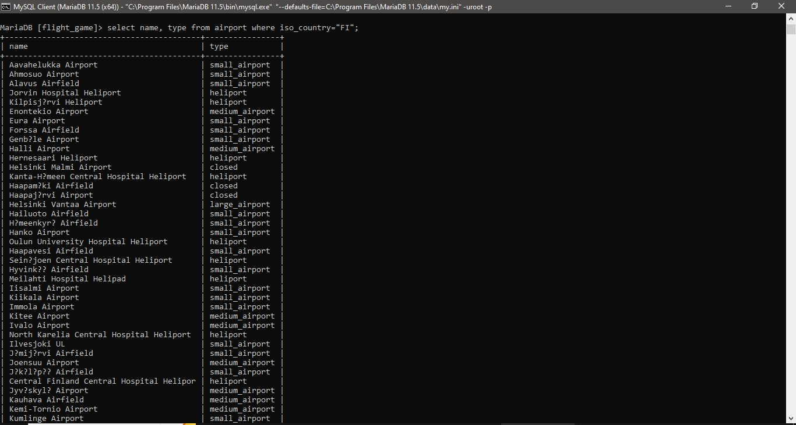

#Week3

Vivek Sharma

###Question 1

select * from goal;

###Question 2

select name, type from airport where iso_country="FI";

###Question 3

select name from airport where iso_country="FI" order by name asc;

###Question 4

select name, type from airport where iso_country="FI" order by type asc,name asc;

###Question 5

select name from country where name like "F%";

###Question 6

select name from country where name like "%F%";

###Question 7

select location from game where screen_name="Vesa";

###Question 8

select co2_consumed from game where screen_name="Ilkka";

###Question 9

select DISTINCT co2_budget from game;

###Question 10

select screen_name, co2_budget, co2_consumed, co2_budget - co2_consumed as co2_left from game where screen_name="Ilkka";
