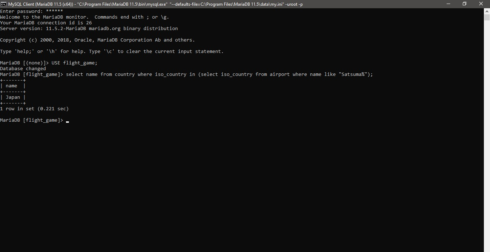
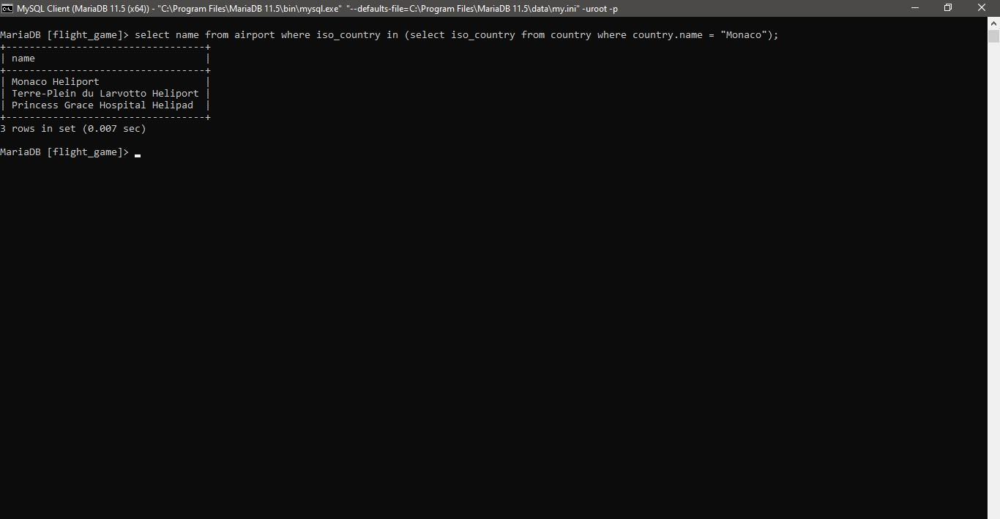
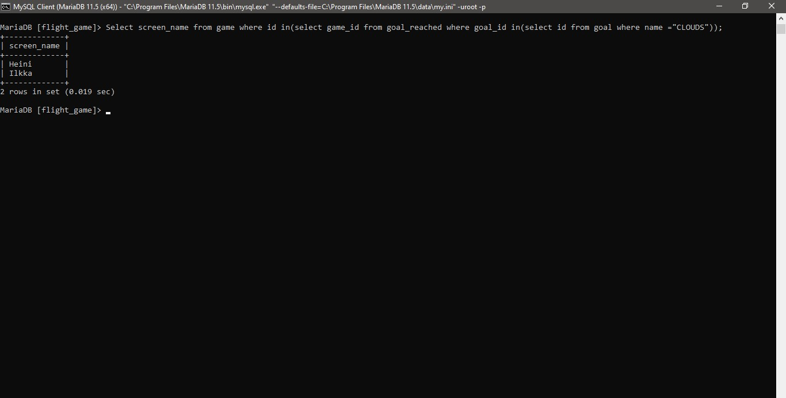
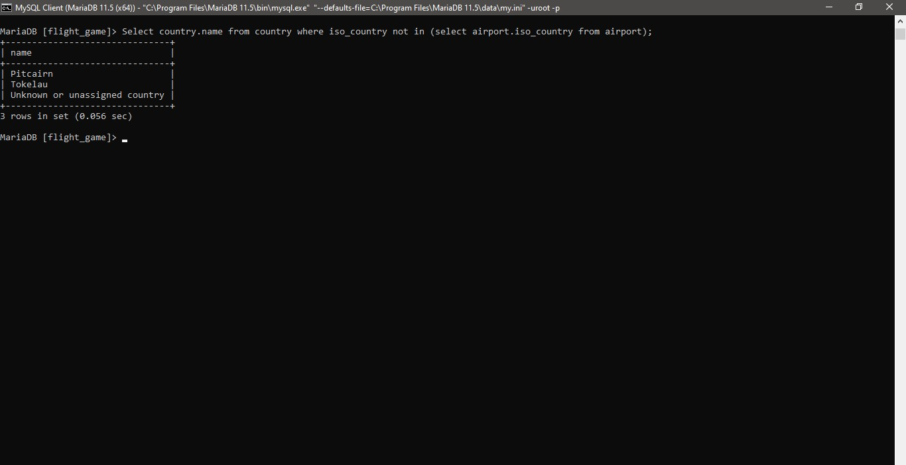
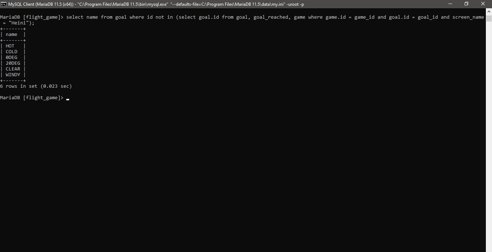

#Week4

Vivek Sharma

###Question 1

select name from country where iso_country in (select iso_country from airport where name like "Satsuma%");

###Question 2

select name from airport where iso_country in (select iso_country from country where country.name = "Monaco");

###Question 3

Select screen_name from game where id in(select game_id from goal_reached where goal_id in(select id from goal where name ="CLOUDS"));

#Question 4

Select country.name from country where iso_country not in (select airport.iso_country from airport);

#Question 5

select name from goal where id not in (select goal.id from goal, goal_reached, game where game.id = game_id and goal.id = goal_id and screen_name = "Heini");
